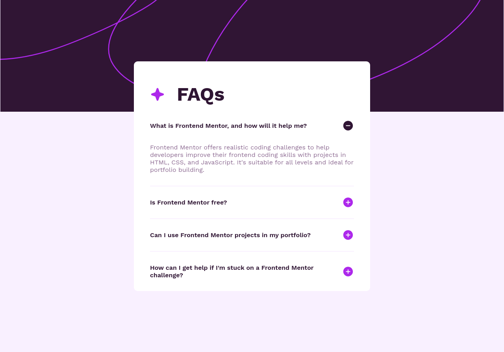

# Frontend Mentor - FAQ accordion solution

This is a solution to the [FAQ accordion challenge on Frontend Mentor](https://www.frontendmentor.io/challenges/faq-accordion-wyfFdeBwBz). Frontend Mentor challenges help you improve your coding skills by building realistic projects. 

## Table of contents

- [Overview](#overview)
  - [Screenshot](#screenshot)
  - [Links](#links)
- [My process](#my-process)
  - [Built with](#built-with)
  - [What I learned](#what-i-learned)
  - [Useful resources](#useful-resources)
- [Author](#author)

## Overview

### Screenshot

### Links

- Solution URL: https://github.com/ThomasH2001/FAQ-Accordion

## My process

### Built with

- Semantic HTML
- CSS media queries
- CSS pseudo-elements
- CSS pseudo-classes
- CSS attribute selectors
- Flexbox

### What I learned

I learned about the details and summary elements and about CSS attribute selectors.

### Useful resources

- [
: The Details disclosure element](https://developer.mozilla.org/en-US/docs/Web/HTML/Element/details)
- [
: The Disclosure Summary element](https://developer.mozilla.org/en-US/docs/Web/HTML/Element/summary)
- [Attribute selectors](https://developer.mozilla.org/en-US/docs/Web/CSS/Attribute_selectors)

## Author

- Frontend Mentor - [@ThomasH2001](https://www.frontendmentor.io/profile/ThomasH2001)
- Github - [@ThomasH2001](https://github.com/ThomasH2001/)
